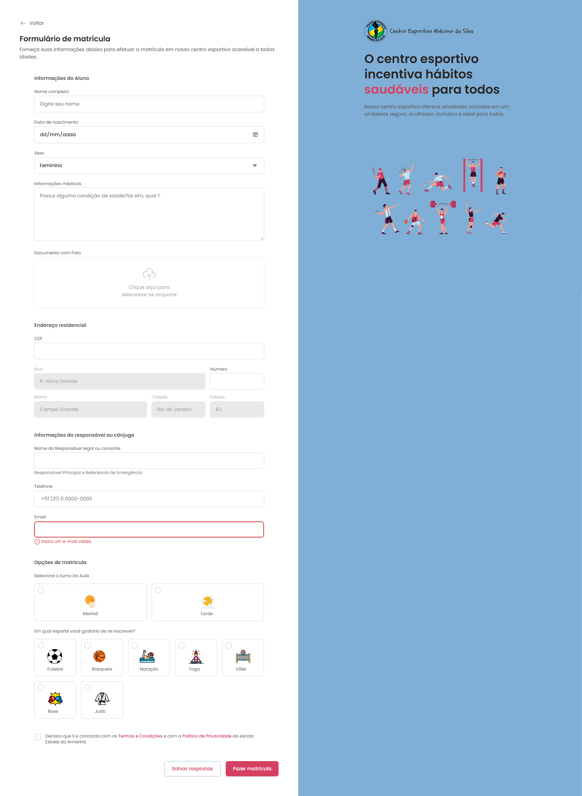

Formulário no HTML — Projeto Rocketseat

Este repositório contém o projeto “Formulário no HTML”, desenvolvido como parte da atividade prática da Rocketseat. O objetivo foi criar um formulário completo utilizando apenas HTML, com foco em marcação semântica, acessibilidade e boa estruturação.

🎨 Personalização

Para tornar o projeto mais realista, personalizei o formulário como se fosse um processo oficial de matrícula do Centro Esportivo Miecimo da Silva, localizado no bairro Campo Grande (RJ).
A proposta foi criar uma experiência simples e intuitiva para inscrição em atividades esportivas para pessoas de todas as idades.

🧱 Tecnologias Utilizadas
HTML5
Estrutura semântica
Fieldsets e legendas
Inputs acessíveis
Labels associados corretamente
Upload de arquivo (documento com foto)
Campos organizados por seções temáticas
📝 Objetivo
Praticar construção de formulários usando apenas HTML
Criar um layout organizado e claro
Simular um fluxo real de matrícula
Aplicar acessibilidade básica e boas práticas de formulário
📸 Preview do Projeto

Imagem de demonstração da interface final do formulário personalizado.

📌 Observações

Este projeto segue fielmente a proposta da Rocketseat — sem CSS e sem JavaScript — focando exclusivamente na marcação HTML.
A estilização presente na prévia é resultado de personalizações feitas por mim após a entrega do exercício base.
